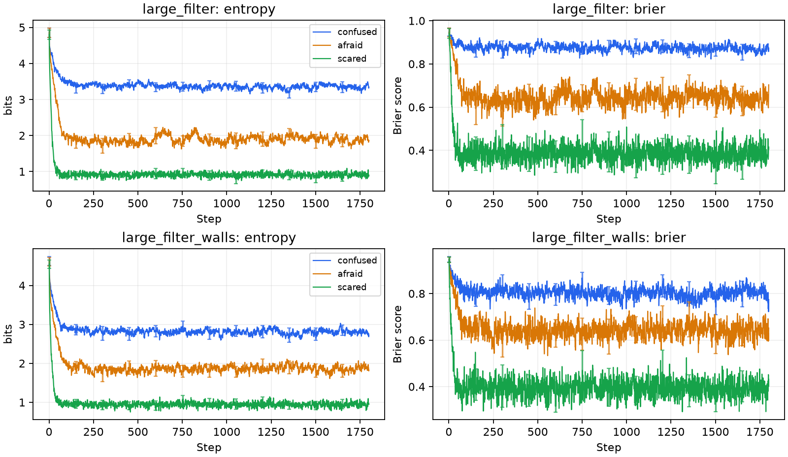
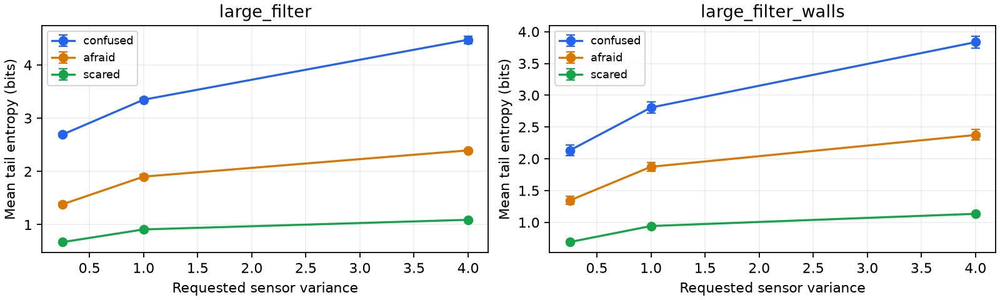

# ผลการตรวจสอบงาน

ตรวจบน Linux / Python 3.14.7 วันที่ 23 กันยายน 2026

## การทดสอบอัลกอริทึม

- Unit tests: **27 ผ่าน**; รายละเอียดเครื่องอ่านได้อยู่ใน `tests.xml`
- โค้ดเอเจนต์ที่เพิ่ม/เติม สคริปต์ และ tests ผ่าน `pycodestyle`
- มีการเทียบวิธีค้นหากับ reference ที่เขียนแยก และตรวจฟังก์ชันห้ามแก้ด้วย AST fingerprint
- รายการรุ่นแพ็กเกจอยู่ใน `../requirements-lock.txt`

## เกมจริง

รัน CLI จริง 45 เกม: ชนะ 45/45 และทุก process จบปกติ
ข้อมูลคำสั่ง คะแนน เวลา และ output ฉบับเต็มอยู่ใน [benchmark.json](benchmark.json)

| Project | Agent | Layout | Ghost | Seed | Score | Expanded nodes |
|---|---|---|---|---|---:|---:|
| 0 | bfs | small | — | 1 | 497 | 23.0 |
| 0 | bfs | medium | — | 1 | 565 | 25761.0 |
| 0 | bfs | large | — | 1 | 429 | 3312.0 |
| 0 | astar | small | — | 1 | 500 | 11.0 |
| 0 | astar | medium | — | 1 | 568 | 351.0 |
| 0 | astar | large | — | 1 | 433 | 227.0 |
| 0 | dfs | small | — | 1 | 487 | 18.0 |
| 0 | dfs | medium | — | 1 | 405 | 362.0 |
| 0 | dfs | large | — | 1 | 314 | 371.0 |
| 1 | minimax | small_adv | dumby | 1 | 516 | 263.0 |
| 1 | minimax | small_adv | dumby | 42 | 516 | 263.0 |
| 1 | minimax | small_adv | greedy | 1 | 516 | 263.0 |
| 1 | minimax | small_adv | greedy | 42 | 516 | 263.0 |
| 1 | minimax | small_adv | smarty | 1 | 516 | 263.0 |
| 1 | minimax | small_adv | smarty | 42 | 516 | 263.0 |
| 1 | hminimax | small_adv | dumby | 1 | 516 | 37.0 |
| 1 | hminimax | small_adv | dumby | 42 | 516 | 37.0 |
| 1 | hminimax | small_adv | greedy | 1 | 516 | 37.0 |
| 1 | hminimax | small_adv | greedy | 42 | 516 | 37.0 |
| 1 | hminimax | small_adv | smarty | 1 | 516 | 37.0 |
| 1 | hminimax | small_adv | smarty | 42 | 516 | 37.0 |
| 1 | hminimax | medium_adv | dumby | 1 | 536 | 2290.0 |
| 1 | hminimax | medium_adv | dumby | 42 | 536 | 2290.0 |
| 1 | hminimax | medium_adv | greedy | 1 | 539 | 1149.0 |
| 1 | hminimax | medium_adv | greedy | 42 | 539 | 1149.0 |
| 1 | hminimax | medium_adv | smarty | 1 | 539 | 1150.0 |
| 1 | hminimax | medium_adv | smarty | 42 | 539 | 1150.0 |
| 1 | hminimax | large_adv | dumby | 1 | 532 | 9089.0 |
| 1 | hminimax | large_adv | dumby | 42 | 532 | 9089.0 |
| 1 | hminimax | large_adv | greedy | 1 | 530 | 3670.0 |
| 1 | hminimax | large_adv | greedy | 42 | 530 | 3670.0 |
| 1 | hminimax | large_adv | smarty | 1 | 530 | 3670.0 |
| 1 | hminimax | large_adv | smarty | 42 | 530 | 3670.0 |
| 2 | pacmanagent | large_filter | confused | 1 | 1073 | — |
| 2 | pacmanagent | large_filter | confused | 42 | 1045 | — |
| 2 | pacmanagent | large_filter | afraid | 1 | 1032 | — |
| 2 | pacmanagent | large_filter | afraid | 42 | 1007 | — |
| 2 | pacmanagent | large_filter | scared | 1 | 1064 | — |
| 2 | pacmanagent | large_filter | scared | 42 | 1028 | — |
| 2 | pacmanagent | large_filter_walls | confused | 1 | 1069 | — |
| 2 | pacmanagent | large_filter_walls | confused | 42 | 947 | — |
| 2 | pacmanagent | large_filter_walls | afraid | 1 | 1066 | — |
| 2 | pacmanagent | large_filter_walls | afraid | 42 | 1003 | — |
| 2 | pacmanagent | large_filter_walls | scared | 1 | 988 | — |
| 2 | pacmanagent | large_filter_walls | scared | 42 | 962 | — |

Project 2 runner ไม่แสดงจำนวน expanded nodes จึงเว้นช่องดังกล่าว
เวลาจริงได้รับผลจาก CPU และการรันสาม process พร้อมกัน จึงดูตัวเลขเวลาใน JSON เป็นข้อมูลเฉพาะเครื่องนี้

## ผลทดลอง Bayes filter

ทดลอง 18 เงื่อนไข: 2 layouts × 3 policies × 3 sensor variances
แต่ละเงื่อนไขมี 30 trials และ 3 ghosts; variance 0.25/1 ใช้ 1,800 steps และ variance 4 ใช้ 9,000 steps
ใช้ seed 193611, Pacman อยู่นิ่ง และปิดการกินผีในตัวจำลอง tracking
ค่าเฉลี่ยและ CI คำนวณข้าม trials หลังเฉลี่ยผีภายในแต่ละ trial

### ผลที่ sensor variance เริ่มต้น = 1

| Layout | Ghost | Entropy ± CI95 (bits) | Brier ± CI95 |
|---|---|---:|---:|
| large_filter | confused | 3.347 ± 0.033 | 0.870 ± 0.006 |
| large_filter | afraid | 1.902 ± 0.042 | 0.644 ± 0.009 |
| large_filter | scared | 0.910 ± 0.006 | 0.384 ± 0.003 |
| large_filter_walls | confused | 2.807 ± 0.085 | 0.800 ± 0.017 |
| large_filter_walls | afraid | 1.875 ± 0.070 | 0.645 ± 0.013 |
| large_filter_walls | scared | 0.943 ± 0.007 | 0.392 ± 0.003 |





### การตีความและข้อจำกัด

- ที่ variance 1 ผลต่าง entropy ของสองหน้าต่างท้าย 600 steps มีขนาดไม่เกินประมาณ 0.014 bits ในทุกเงื่อนไข
- entropy และ Brier ต่ำลงเมื่อเปลี่ยนจาก confused ไป afraid และ scared ในสองแผนที่ที่ทดลอง
- variance สูงขึ้นทำให้ความไม่แน่นอนช่วงท้ายสูงขึ้นในการทดลองนี้
- แม้ขยายการทดลอง variance 4 เป็น 9,000 steps แล้ว confused ยังมี entropy ลดลงต่อ: ผลเปรียบเทียบส่วนนี้เป็นผลในระยะเวลาที่วัด ไม่ใช่การยืนยันว่าเข้าถึง equilibrium
- การทดลอง Pacman นิ่งไม่แทนกรณี Pacman เดินอิสระทุกแบบ; benchmark ของ engine จริงตรวจ controller ที่เดินและกินผีอีก 12 เกม
- การจำลอง tracking อ่าน policy เดิมผ่าน adapter แบบไม่เกิด collision และไม่ได้สุ่มจาก transition matrix ของ filter เอง
- ยังไม่ได้ทดสอบกราฟิกจริง เพราะเครื่องทดสอบไม่มี Tk; ตรวจเฉพาะ headless
- ยังไม่ได้รันระบบตรวจส่วนตัวหรือแผนที่ลับของอาจารย์

ข้อมูลดิบ: [trials.npz](../project2/results/trials.npz)
การตั้งค่าและสถิติทั้งหมด: [summary.json](../project2/results/summary.json)

## สร้างผลซ้ำ

```bash
python -m pytest -q --junitxml=docs/tests.xml
python scripts/benchmark.py
python project2/experiments.py --trials 30 --steps 1800 --high-noise-steps 9000 --ghosts 3 --seed 193611
python scripts/build_report.py
python scripts/package_submissions.py
```

ชื่อผู้จัดทำใน PDF เว้นว่างตามคำขอ และคู่มือการแบ่งงานใช้กลุ่มสามคนตามข้อมูลล่าสุดจากผู้ใช้
ก่อนส่งจริงให้ทบทวนรายงานและข้อกำหนดรายวิชาปัจจุบัน
