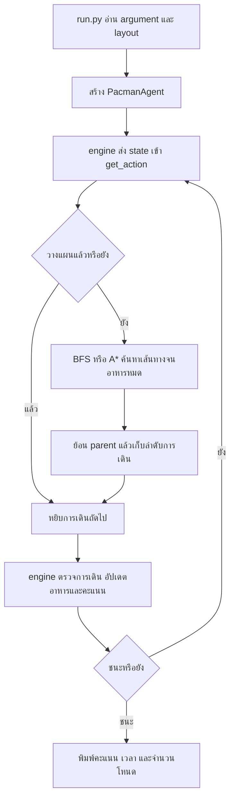
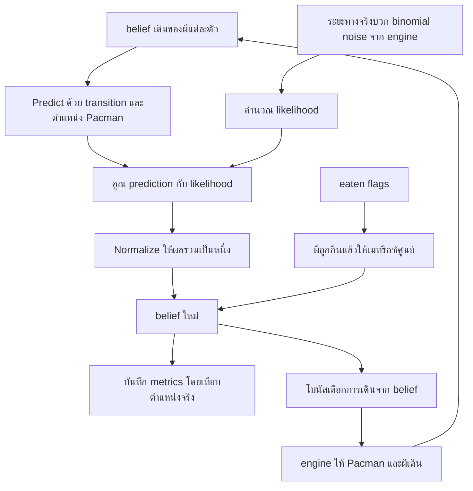

# ขั้นตอนการทำงานและแบ่งงานสำหรับสามคน

เอกสารนี้อธิบายทั้งลำดับการพัฒนาและการไหลของข้อมูลขณะรัน
ขั้นตอนติดตั้งและคำสั่งเต็มอยู่ใน [INSTALL_AND_RUN_TH.md](INSTALL_AND_RUN_TH.md)

## 1. ภาพรวมของงาน

| ส่วน | ข้อมูลที่เอเจนต์รู้ | เป้าหมาย | วิธี |
|---|---|---|---|
| Project 0 | กำแพง อาหาร แคปซูล ตำแหน่งตนเอง | กินอาหารครบ | BFS, A* |
| Project 1 | สถานะเกมและการเดินที่ผีทำได้ | ชนะพร้อมทำคะแนน | Minimax, H-Minimax |
| Project 2 | ระยะทางมี noise, แบบจำลองผี, กำแพง | ประมาณตำแหน่งผี | Bayes filter |
| Bonus | ตำแหน่งตนเอง การเดินที่อนุญาต belief | กินผีล่องหน | ตัวควบคุมตาม belief |

## 2. ไฟล์สำคัญและความรับผิดชอบ

```text
SCI193611_PACMAN_PROJECTS/
├── project0/
│   ├── bfs.py                  BFS ที่ใช้ FIFO
│   ├── astar.py                A* กับ heuristic จากระยะทางในเขาวงกต
│   ├── dfs.py                  ตัวอย่าง DFS ที่เติมส่วนขาดแล้ว
│   └── run.py                  ตัวเริ่มเกมของ Project 0
├── project1/
│   ├── minimax.py              Minimax แบบแก้กราฟครบ
│   ├── hminimax.py             Minimax จำกัดความลึกและ alpha-beta
│   └── run.py                  ตัวเริ่มเกมของ Project 1
├── project2/
│   ├── bayesfilter.py          แบบจำลองและอัปเดต belief
│   ├── pacmanagent.py          โบนัสตัวควบคุม
│   ├── experiments.py         ทดลองซ้ำและสร้างกราฟ
│   ├── results/               ข้อมูลจริงและรูปกราฟ
│   ├── report.tex             คำตอบในเทมเพลต
│   └── report.pdf             รายงานภาษาอังกฤษ เว้นชื่อ
├── scripts/
│   ├── benchmark.py           ทดสอบ CLI เกมจริง
│   ├── build_report.py        เติมรายงานจากผลทดลองและคอมไพล์
│   └── package_submissions.py รวมไฟล์ตามข้อกำหนด
├── tests/                     การทดสอบอัลกอริทึมและข้อห้ามแก้ฟังก์ชัน
├── docs/                      คู่มือและผลตรวจ
└── deliverables/              ชุดไฟล์ส่งงาน
```

`pacman_module` ในแต่ละโปรเจกต์เป็น engine คนละชุด ถึงจะชื่อเหมือนกัน
ไม่ควรเอา engine ของโปรเจกต์หนึ่งไปแทนอีกโปรเจกต์หนึ่ง
เอเจนต์ที่ส่งแต่ละตัวอยู่ได้ด้วยไฟล์ของตัวเองและ engine ของโจทย์
ไม่มีการ import helper ข้ามไฟล์ส่งงาน

## 3. ลำดับทำงานที่แนะนำ

1. ติดตั้ง environment และลองเอเจนต์หนึ่งตัวให้จบเกม
2. ทำความเข้าใจ state, legal action, successor, food และคะแนน
3. เริ่ม BFS เพื่อเห็น frontier, visited และการย้อน parent
4. เรียน A* และพิสูจน์ว่า heuristic ไม่สูงกว่าค่าใช้จ่ายจริง
5. เรียน Minimax ว่าเหตุใดผีจึงเป็นฝ่ายเลือกผลที่แย่ต่อ Pacman
6. เรียน H-Minimax เพื่อจัดการพื้นที่สถานะใหญ่
7. ทำแบบจำลองเซนเซอร์และการเดินผีเป็นสมการก่อนอ่าน Bayes filter
8. ตรวจ normalization, multiple ghosts, eaten flags และตำแหน่ง Pacman ที่เปลี่ยน
9. รันการทดลอง เก็บผล สร้างกราฟ และอธิบายตัวเลข
10. อ่าน PDF เทียบกับโจทย์ จากนั้นสร้างชุดส่งงาน

## 4. การไหลของ Project 0



ที่วางแผนครั้งเดียวได้เพราะโจทย์ส่วนนี้ไม่มีผีที่ทำให้โลกเปลี่ยนระหว่างทาง
ตัว `planned` แยกระหว่าง “ยังไม่ได้หาแผน” กับ “แผนใช้ครบแล้ว”
ถ้าไม่มีเส้นทางไปกินอาหารครบ โค้ดแจ้ง `ValueError` แทนการวนหาแผนตลอดไป

## 5. การไหลของ Project 1

เครื่องเกมสลับ Pacman แล้วผี ในแต่ละตา Pacman เห็นสถานะจริงล่าสุด

Minimax สร้างกราฟทั้งหมดในครั้งแรก เก็บค่าที่แย่ที่สุดซึ่งรับประกันได้
แล้วเลือก action จาก policy ที่แก้ไว้ เมื่อเจอสถานะใหม่ที่ไม่ได้เก็บจึงคำนวณใหม่
H-Minimax ค้นใหม่ทุกตา เพราะใช้ขอบเขตสั้นและต้องตอบสนองตำแหน่งผีล่าสุด

ผีของเกมจริงอาจเดินแบบ `dumby`, `greedy` หรือ `smarty`
แต่เอเจนต์ไม่ได้อ่านชนิดผีเพื่อคาดเดาว่าจะเลือกเพียงทางเดียว
ในต้นไม้การตัดสินใจต้องพิจารณาการเดินที่ผีทำได้ทั้งหมด

## 6. การไหลของ Project 2



ข้อมูลตำแหน่งจริงที่ใช้บันทึก metrics ไม่ได้ส่งย้อนเข้า filter หรือ controller
controller เรียกจาก state แค่ตำแหน่ง Pacman กับชุด legal actions
แผนที่ที่ controller ใช้หลบกำแพงเป็นแผนที่ที่เรียนรู้จากประสบการณ์การเดิน

เกมเดิมเริ่มด้วยการเรียก belief agent ก่อน Pacman เดิน
ฟังก์ชันที่โจทย์ห้ามแก้ยังเรียก predict/update ตามสัญญาเดิมทุกครั้ง
การทดลองควบคุมจัดลำดับ ghost transition แล้ว observation ในแต่ละ step อย่างชัดเจน

## 7. การทดลองสองแบบมีหน้าที่ต่างกัน

| ชุด | สิ่งที่วัด | สถานการณ์ |
|---|---|---|
| `scripts/benchmark.py` | รันจบไหม ชนะไหม คะแนน เวลา โหนด | engine จริง Pacman เดินและกินผีได้ |
| `project2/experiments.py` | entropy, Brier, error bars, การเปลี่ยนตาม noise | Pacman นิ่ง ผีไม่ถูกลบจากการกิน |

เหตุผลที่การทดลอง filter ใช้เกมจำลองแบบไม่กินผี:
ถ้าผีที่ติดตามง่ายถูกกินก่อน เราจะเหลือแต่ผีติดตามยากในค่าเฉลี่ยช่วงท้าย
และแต่ละ trial จะมีความยาวต่างกัน วิธีควบคุมนี้ทำให้เปรียบเทียบ model กับ noise ได้ตรงขึ้น
เป็นข้อจำกัดของการทดลองเช่นกัน: กราฟนี้ไม่ใช่หลักฐานว่า controller ที่เดินทุกรูปแบบ
จะมี entropy แบบเดียวกัน การทดสอบเกมจริงจึงทำเพิ่มแยกต่างหาก

## 8. แบ่งงานสามคน

| สมาชิก | งานหลัก | สิ่งที่ต้องอธิบายได้ | ตรวจงานของเพื่อน |
|---|---|---|---|
| คนที่ 1 | Project 0 และ setup | BFS, A*, state key, MST heuristic, capsule cost | รันเกมและคู่มือติดตั้งจากเครื่องใหม่ |
| คนที่ 2 | Project 1 และ tests | Minimax, cycle, retrograde, alpha-beta, evaluation | ตรวจการใช้ API และกรณีขอบ |
| คนที่ 3 | Project 2 และรายงาน | sensor/transition, Bayes update, metrics, confidence interval | เทียบ PDF กับข้อมูลดิบและชื่อไฟล์ส่ง |

ทุกคนควรอ่านภาพรวมทั้งหมดและลองรันโค้ดของอีกสองคน
ส่วนที่เชื่อมกัน เช่น API, คะแนน และการตีความผล ควรทบทวนร่วมกันก่อนส่ง
ไม่ใส่ชื่อบุคคลในตารางและรายงานตามคำขอ

## 9. เกณฑ์จบงานและสิ่งที่ต้องทำเมื่อแก้โค้ด

งานหนึ่งส่วนถือว่าพร้อมตรวจเมื่อ:

- ฟังก์ชันทำงานตรงสมการหรืออัลกอริทึมที่อธิบาย
- ทดสอบกับ reference หรือคุณสมบัติที่ตรวจได้ ไม่ใช่แค่เกมเดียวชนะ
- CLI ตัวจริงรันจบ ไม่มี illegal move และผลบันทึกอ่านได้
- docstring ระบุ input/output และข้อจำกัด
- โค้ดใหม่ผ่าน PEP 8

ถ้าแก้ Project 0/1 ให้รัน unit tests และ benchmark ที่เกี่ยวข้อง
ถ้าแก้ Bayes filter ต้องสร้างผลทดลองใหม่ด้วย เพราะกราฟและรายงานขึ้นกับโค้ด
จากนั้นสร้าง PDF และ archive ใหม่ตามลำดับ

## 10. ข้อกำหนดงานที่ต้องจำ

Project 0 ให้ BFS 20%, A* 75%, รูปแบบโค้ด 5%
Project 1 ให้ Minimax 45%, H-Minimax 50%, รูปแบบโค้ด 5%
Project 2 มีคำตอบเชิงคณิตศาสตร์ การเขียน filter การทดลอง และ code style รวม 20 คะแนน
ตัวควบคุมกินผีเป็นโบนัส 3 คะแนน

Project 2 ต้องใช้ชื่อ `BeliefStateAgent` และไม่แก้ `get_action`, `_get_evidence`,
`update_belief_state` ที่ต้นฉบับระบุห้ามแก้ มี test ตรวจ fingerprint ของ AST
เทียบกับต้นฉบับที่บันทึกไว้ก่อนแก้จริง

ผลทดสอบสาธารณะและ tests ที่เพิ่มขึ้นเป็นหลักฐานประกอบความถูกต้อง
ยังไม่ใช่ผลจากระบบตรวจส่วนตัวของอาจารย์
